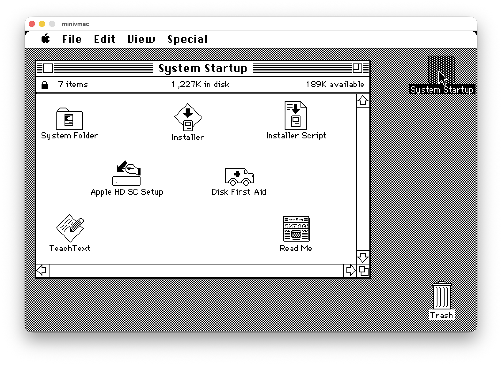

# Mini vMac for Apple Silicon

Native ARM64 build of Mini vMac (Macintosh Plus emulator) optimized for modern macOS.



## Features

- **Native Apple Silicon Support**: Compiled for ARM64 architecture (M1/M2/M3)
- **Metal Graphics Rendering**: Modern Metal framework for optimal performance
- **Retina Display Support**: Proper high-DPI rendering
- **Resizable Window**: Dynamic window sizing with aspect ratio preservation
- **Background Execution**: Continues running when app is in background
- **Classic Mac Emulation**: Emulates Macintosh Plus with 68000 processor

## Quick Start

### Building from Source

```bash
# 1. Build the setup tool
gcc setup/tool.c -o setup_tool

# 2. Generate build configuration
./setup_tool -t mc64 > setup.sh
chmod +x setup.sh
./setup.sh

# 3. Build Mini vMac
make
```

The application will be created at `minivmac.app`.

### Running Mini vMac

1. Obtain a Macintosh Plus ROM file (typically named `vMac.ROM`)
2. Place the ROM file in the same directory as minivmac.app
3. Launch Mini vMac
4. Drag and drop `.dsk` disk images onto the window to mount them

## Changelog

### 2025-11-05
- **Metal Graphics Rendering Migration**
  - Complete migration from deprecated OpenGL to Apple's Metal framework
  - Implemented Metal vertex and fragment shaders for rendering
  - Added aspect ratio preservation with automatic letterboxing/pillarboxing
  - Dynamic filtering: pixel-perfect (nearest neighbor) at native resolution, smooth scaling (linear) when resized
  - Removed all OpenGL dependencies and code
  - Result: Modern, future-proof rendering with better performance and compatibility

- **Window Management Improvements**
  - **Resizable Window**: Window can now be resized by dragging edges/corners
  - **Fullscreen Alignment**: Fixed pixel plane centering in fullscreen mode
  - **Screen Stretching**: Pixel plane now stretches to fit window size while maintaining aspect ratio
  - Proper viewport sizing for accurate rendering at any window size

- **Background Execution**
  - Emulator continues running when app loses focus (goes to background)
  - Audio playback continues in background
  - Configurable via `WantInitRunInBackground` setting
  - Result: Can listen to music or run processes while using other apps

- **Bug Fixes**
  - Fixed drag and drop registration (restored to original window-based registration)
  - Fixed Metal layer initialization after window recreation
  - Improved screen change notification handling for fullscreen transitions

### 2024-11-04
- **Fixed audio output issues** ([#2](https://github.com/hongjuny/Mini_vMac_ARM/commit/XXXXXX))
  - Updated deprecated Component Manager API to modern AudioComponent API
  - Replaced `FindNextComponent` with `AudioComponentFindNext`
  - Replaced `OpenAComponent` with `AudioComponentInstanceNew`
  - Replaced `CloseComponent` with `AudioComponentInstanceDispose`
  - Result: Audio now works correctly on modern macOS including with Bluetooth devices

- **Fixed Retina display scaling** ([#1](https://github.com/hongjuny/Mini_vMac_ARM/commit/XXXXXX))
  - Modified `src/OSGLUCCO.m` to properly handle high-DPI displays
  - Use `convertRectToBacking` for correct framebuffer dimensions
  - Apply `backingScaleFactor` to `glPixelZoom` for proper pixel scaling
  - Scale `glRasterPos2i` coordinates to match physical framebuffer
  - Result: Full window utilization on Retina displays instead of quarter-screen rendering

### 2024-11-03
- **Initial ARM64 port**
  - Successfully compiled for Apple Silicon
  - Native performance on M1/M2/M3 processors
  - Maintained compatibility with existing disk images

## Known Issues

- None currently known

## Technical Notes

### Metal Rendering
The emulator now uses Apple's Metal framework for all graphics rendering:
- Metal shaders handle aspect ratio preservation automatically
- Dynamic filtering based on window size (pixel-perfect vs smooth scaling)
- Proper viewport management for accurate rendering at any resolution
- Optimized for Apple Silicon GPUs

### Retina Display Support
High-DPI displays are fully supported through Metal's native backing scale handling:
1. Metal layer automatically adjusts `contentsScale` based on window's `backingScaleFactor`
2. Viewport and drawable sizes are calculated correctly for Retina displays
3. Texture coordinates are properly mapped to physical pixels

### Build Configuration
- Target: `mc64` (macOS 64-bit)
- Compiler: Xcode Command Line Tools GCC/Clang
- Frameworks: AppKit, AudioUnit, Metal, QuartzCore

## Contributing

Issues and pull requests are welcome. Please test on both Retina and non-Retina displays when making rendering changes.

## Original Project

Mini vMac is created by Paul C. Pratt. Visit [gryphel.com/c/minivmac/](https://www.gryphel.com/c/minivmac/) for the original project.

## License

GNU General Public License version 2. See README.txt for full license text.