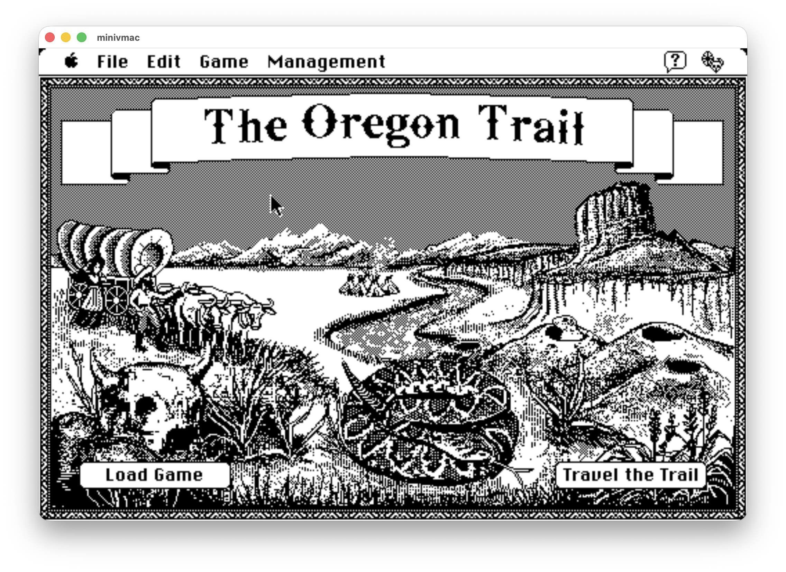

# Mini vMac for Apple Silicon

Native ARM64 build of Mini vMac (Macintosh Plus emulator) optimized for modern macOS.


## Features

- **Native Apple Silicon Support**: Compiled for ARM64 architecture (M1/M2/M3)
- **Metal Graphics Rendering**: Modern Metal framework for optimal performance
- **Retina Display Support**: Proper high-DPI rendering
- **Resizable Window**: Dynamic window sizing with aspect ratio preservation
- **Background Execution**: Continues running when app is in background
- **Classic Mac Emulation**: Emulates Macintosh Plus with 68000 processor

## Quick Start

### Prerequisites

- **macOS**: macOS 10.11 (El Capitan) or later (Apple Silicon recommended)
- **Xcode Command Line Tools**: Required for compilation
  ```bash
  # Install Command Line Tools (if not already installed)
  xcode-select --install
  ```
  If the above command doesn't work, you can also install them through Xcode:
  - Open Xcode
  - Go to Preferences > Locations
  - Install Command Line Tools

### Building from Source

Follow these steps to build Mini vMac from scratch:

#### Step 1: Build the Setup Tool

The setup tool generates the build configuration files needed for compilation.

```bash
gcc setup/tool.c -o setup_tool
```

This compiles the setup tool that will generate the Makefile and other configuration files.

#### Step 2: Generate Build Configuration

Run the setup tool to generate the build configuration:

```bash
./setup_tool -t mc64 > setup.sh
chmod +x setup.sh
./setup.sh
```

This creates:
- `Makefile` - Build configuration for your system
- `cfg/` directory - Platform-specific configuration files

#### Step 3: Build Mini vMac

Compile the application:

```bash
make
```

The build process will:
- Compile all source files (`.c` and `.m` files)
- Link with required frameworks (AppKit, AudioUnit, Metal, QuartzCore)
- Create the application bundle at `minivmac.app/`

**Build Output:**
- Application: `minivmac.app/Contents/MacOS/minivmac`
- Metal shaders: `minivmac.app/Contents/Resources/shaders.metal` (compiled at runtime)

#### Troubleshooting

**If you get "command not found: xcrun" or Metal compiler errors:**
- This is normal if you only have Command Line Tools installed
- The Metal shaders will be compiled at runtime (slightly slower first launch)
- To enable build-time compilation, install full Xcode from the App Store

**If compilation fails:**
- Make sure Command Line Tools are installed: `xcode-select --install`
- Check that you're on macOS 10.11 or later
- Try cleaning and rebuilding: `make clean && make`

### Running Mini vMac

1. **Obtain a Macintosh Plus ROM file**
   - You need a Macintosh Plus ROM file (typically named `vMac.ROM`)
   - This must be obtained separately as it contains copyrighted Apple code
   - Place the ROM file in the same directory as `minivmac.app`

2. **Launch the Application**
   - Double-click `minivmac.app` or run from terminal:
     ```bash
     ./minivmac.app/Contents/MacOS/minivmac
     ```

3. **Mount Disk Images**
   - Drag and drop `.dsk` disk image files onto the Mini vMac window
   - The disk will appear on the desktop
   - You can mount multiple disks

4. **Enjoy Classic Mac Software**
   - Run classic Macintosh applications and games
   - Experience the nostalgia of early Mac computing!



*Oregon Trail running on Mini vMac - Classic Mac software in action!*

## Changelog

### 2025-11-05
- **Metal Graphics Rendering Migration**
  - Complete migration from deprecated OpenGL to Apple's Metal framework
  - Implemented Metal vertex and fragment shaders for rendering
  - Added aspect ratio preservation with automatic letterboxing/pillarboxing
  - Dynamic filtering: pixel-perfect (nearest neighbor) at native resolution, smooth scaling (linear) when resized
  - Removed all OpenGL dependencies and code
  - Result: Modern, future-proof rendering with better performance and compatibility

- **Window Management Improvements**
  - **Resizable Window**: Window can now be resized by dragging edges/corners
  - **Fullscreen Alignment**: Fixed pixel plane centering in fullscreen mode
  - **Screen Stretching**: Pixel plane now stretches to fit window size while maintaining aspect ratio
  - Proper viewport sizing for accurate rendering at any window size

- **Background Execution**
  - Emulator continues running when app loses focus (goes to background)
  - Audio playback continues in background
  - Configurable via `WantInitRunInBackground` setting
  - Result: Can listen to music or run processes while using other apps

- **Bug Fixes**
  - Fixed Metal layer initialization after window recreation
  - Improved screen change notification handling for fullscreen transitions

### 2024-11-04
- **Fixed audio output issues** ([#2](https://github.com/hongjuny/Mini_vMac_ARM/commit/XXXXXX))
  - Updated deprecated Component Manager API to modern AudioComponent API
  - Replaced `FindNextComponent` with `AudioComponentFindNext`
  - Replaced `OpenAComponent` with `AudioComponentInstanceNew`
  - Replaced `CloseComponent` with `AudioComponentInstanceDispose`
  - Result: Audio now works correctly on modern macOS including with Bluetooth devices

- **Fixed Retina display scaling** ([#1](https://github.com/hongjuny/Mini_vMac_ARM/commit/XXXXXX))
  - Modified `src/OSGLUCCO.m` to properly handle high-DPI displays
  - Use `convertRectToBacking` for correct framebuffer dimensions
  - Apply `backingScaleFactor` to `glPixelZoom` for proper pixel scaling
  - Scale `glRasterPos2i` coordinates to match physical framebuffer
  - Result: Full window utilization on Retina displays instead of quarter-screen rendering

### 2024-11-03
- **Initial ARM64 port**
  - Successfully compiled for Apple Silicon
  - Native performance on M1/M2/M3 processors
  - Maintained compatibility with existing disk images

## Known Issues

- None currently known

## Technical Notes

### Metal Rendering
The emulator now uses Apple's Metal framework for all graphics rendering:
- Metal shaders handle aspect ratio preservation automatically
- Dynamic filtering based on window size (pixel-perfect vs smooth scaling)
- Proper viewport management for accurate rendering at any resolution
- Optimized for Apple Silicon GPUs

### Retina Display Support
High-DPI displays are fully supported through Metal's native backing scale handling:
1. Metal layer automatically adjusts `contentsScale` based on window's `backingScaleFactor`
2. Viewport and drawable sizes are calculated correctly for Retina displays
3. Texture coordinates are properly mapped to physical pixels

### Build Configuration
- Target: `mc64` (macOS 64-bit)
- Compiler: Xcode Command Line Tools GCC/Clang
- Frameworks: AppKit, AudioUnit, Metal, QuartzCore

## Contributing

Issues and pull requests are welcome. Please test on both Retina and non-Retina displays when making rendering changes.

## Original Project

Mini vMac is created by Paul C. Pratt. Visit [gryphel.com/c/minivmac/](https://www.gryphel.com/c/minivmac/) for the original project.

## License

GNU General Public License version 2. See README.txt for full license text.